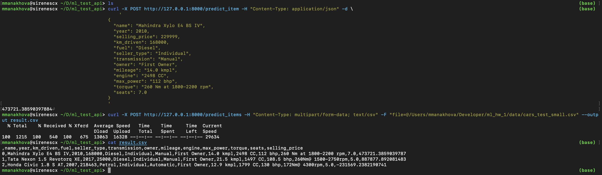

    

## Machine Learning Homework ###

### What was done?

#### DS part ([code](https://github.com/sirenescx/ml_hw_1/blob/master/notebooks/HW1_Regression_with_inference.ipynb))

 - data preprocessing 
 - model training and hyperparameter optimization
 - production metrics implementation
 - model saving in `.pickle` format
 - additionally: 
   - calculation of targeting statistics (average, minimum and maximum values, quantiles)
   - boxplot with emissions visualization
   - studied the dependence of the average car value on the values of categorical variables
   - `CatBoostEncoder` (target encoding) used to encode categorical variables except `seats`.
   - polynomial features added

**Results:** best model on test sample gives `R^2 score = 0.8473638652284115`, `business_metrics = 0.294`

#### FastApi part ([code](https://github.com/sirenescx/ml_hw_1/blob/master/api/api.py))
- implemented a pipeline class ([code](https://github.com/sirenescx/ml_hw_1/blob/master/api/preprocessing_pipeline/pipeline.py)) for preprocessing, encoding and scaling data.
- implemented api with two methods:
  - `predict_item`, which receives JSON file with one object as input and returns one real number - model prediction
  - `predict_items`, which receives as input a CSV file with one or more objects and returns a CSV file containing a feature description of the objects and predictions for each of them

### Results

